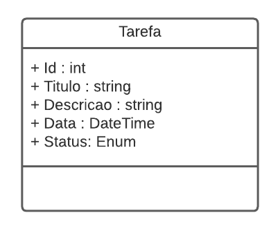
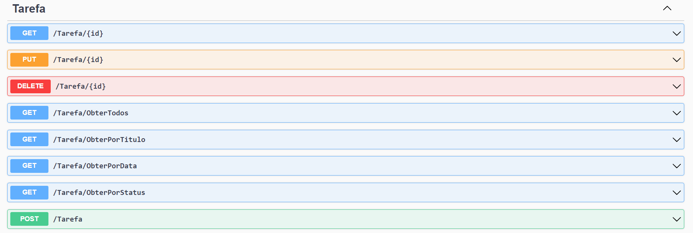
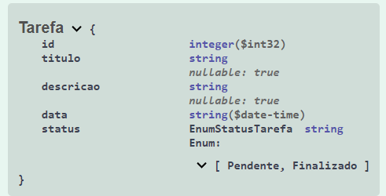

# API de Gerenciamento de Tarefas

Projeto desenvolvido como parte do curso **DIO - XP Inc. Full Stack Developer**, na trilha de .NET, durante o módulo de **API e Entity Framework**.

A atividade consiste na construção de uma Web API para organizar tarefas. A aplicação disponibiliza operações de criação, consulta, atualização e exclusão (CRUD), além de filtros por título, data e status.

## Objetivos da atividade

- Aplicar os fundamentos de uma Web API com ASP.NET Core.
- Criar endpoints seguindo os princípios de uma API REST.
- Modelar uma entidade com C# e Entity Framework Core.
- Persistir dados em um banco SQLite.
- Criar e utilizar migrations para manter o schema do banco.
- Documentar e testar a API por meio do Swagger.

## Tecnologias utilizadas

- C#;
- .NET 8;
- ASP.NET Core Web API;
- Entity Framework Core 8;
- SQLite;
- Swagger/OpenAPI;
- Visual Studio ou Visual Studio Code.

## Estrutura do projeto

```text
trilha-net-api-desafio/
├── Context/
│   └── OrganizadorContext.cs
├── Controllers/
│   └── TarefaController.cs
├── Migrations/
│   └── 20260810040939_InitialCreate.cs
├── Models/
│   ├── EnumStatusTarefa.cs
│   └── Tarefa.cs
├── Program.cs
├── TrilhaApiDesafio.csproj
└── tarefas.db
```

## Modelo da tarefa

A entidade `Tarefa` possui os seguintes campos:

| Campo | Tipo | Descrição |
|---|---|---|
| `Id` | `int` | Identificador único da tarefa |
| `Titulo` | `string` | Título da tarefa |
| `Descricao` | `string` | Detalhamento da tarefa |
| `Data` | `DateTime` | Data da tarefa |
| `Status` | `EnumStatusTarefa` | Situação atual da tarefa |

Os status disponíveis são:

- `Pendente`;
- `Finalizado`.



## Endpoints

A API utiliza a rota base `/Tarefa`.

| Método | Endpoint | Descrição |
|---|---|---|
| `GET` | `/Tarefa/{id}` | Busca uma tarefa pelo identificador |
| `GET` | `/Tarefa/ObterTodos` | Retorna todas as tarefas |
| `GET` | `/Tarefa/ObterPorTitulo?titulo={titulo}` | Filtra tarefas pelo título |
| `GET` | `/Tarefa/ObterPorData?data={data}` | Filtra tarefas pela data, ignorando o horário |
| `GET` | `/Tarefa/ObterPorStatus?status={status}` | Filtra tarefas por status |
| `POST` | `/Tarefa` | Cadastra uma nova tarefa |
| `PUT` | `/Tarefa/{id}` | Atualiza uma tarefa existente |
| `DELETE` | `/Tarefa/{id}` | Exclui uma tarefa |

### Exemplo de payload

```json
{
  "titulo": "Estudar Entity Framework",
  "descricao": "Revisar DbContext, migrations e operações CRUD.",
  "data": "2026-09-25T19:00:00Z",
  "status": "Pendente"
}
```

O campo `id` é gerado pelo banco de dados no cadastro. Os valores do campo `status` devem ser `Pendente` ou `Finalizado`.

### Exemplos de filtros

```text
GET /Tarefa/ObterPorTitulo?titulo=Entity
GET /Tarefa/ObterPorData?data=2026-09-25
GET /Tarefa/ObterPorStatus?status=Pendente
```

### Principais respostas HTTP

- `200 OK`: consulta ou atualização realizada com sucesso;
- `201 Created`: tarefa criada com sucesso;
- `204 No Content`: tarefa excluída com sucesso;
- `400 Bad Request`: dados inválidos, como uma tarefa sem data;
- `404 Not Found`: tarefa não encontrada.

## Banco de dados e migrations

Os dados são persistidos no arquivo local `tarefas.db`, utilizando SQLite. A migration inicial cria a tabela `Tarefas` com as colunas da entidade `Tarefa`.

Para criar uma nova migration após alterar o modelo:

```bash
dotnet ef migrations add NomeDaMigration
```

Para aplicar as migrations ao banco:

```bash
dotnet ef database update
```

Caso o comando `dotnet ef` ainda não esteja disponível, instale a ferramenta:

```bash
dotnet tool install --global dotnet-ef
```

## Como executar

### Pré-requisitos

- .NET SDK 8.0 ou superior;
- Git;
- Uma IDE ou editor de código compatível com .NET.

### Passo a passo

1. Clone o repositório:

   ```bash
   git clone https://github.com/Digooow/dio-xp-inc-full-stack-developer.git
   ```

2. Acesse a pasta da atividade:

   ```bash
   cd dio-xp-inc-full-stack-developer/trilha-net-api-desafio
   ```

3. Restaure as dependências:

   ```bash
   dotnet restore
   ```

4. Aplique as migrations:

   ```bash
   dotnet ef database update
   ```

5. Execute a aplicação:

   ```bash
   dotnet run
   ```

6. Abra a documentação interativa:

   ```text
   https://localhost:7295/swagger
   ```

Também é possível acessar a aplicação pela URL HTTP `http://localhost:5181/swagger`, conforme as configurações de execução do projeto.

## Swagger

Em ambiente de desenvolvimento, o Swagger permite visualizar os endpoints, consultar os schemas e executar requisições diretamente pelo navegador.



## Schema da tabela



## Aprendizados

Esta atividade reforça a criação de APIs com ASP.NET Core, a separação entre controller, contexto e modelo, o uso do Entity Framework Core para acesso a dados e a evolução do banco por meio de migrations.

## Curso

Este projeto faz parte do curso **DIO - XP Inc. Full Stack Developer**, oferecido pela [Digital Innovation One](https://www.dio.me/).
