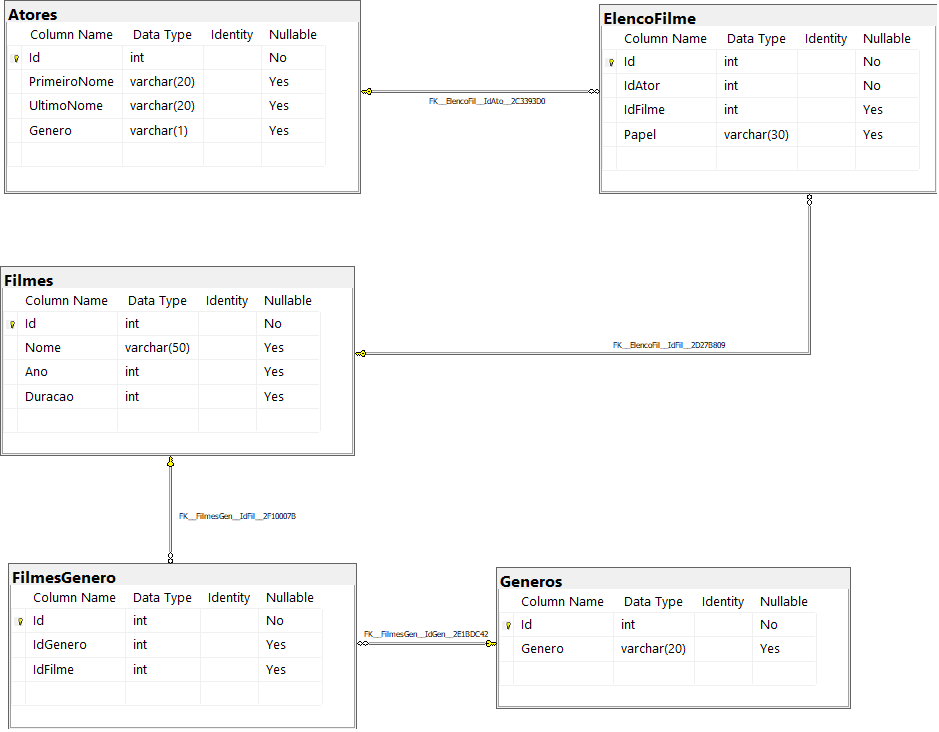

# Desafio de Banco de Dados: Filmes

Atividade desenvolvida durante o curso **[DIO XP Inc. - Full Stack Developer](https://www.dio.me/)**, na trilha de .NET, para praticar consultas SQL em um banco de dados relacional.

## Sobre a atividade

O desafio simula o banco de dados de um site de filmes. A partir de uma base previamente modelada e populada, foram elaboradas 12 consultas para obter informações sobre filmes, atores, gêneros e elenco.

Os exercícios praticam:

- seleção e projeção de colunas com `SELECT`;
- filtros com `WHERE`;
- ordenação com `ORDER BY`;
- operadores relacionais e lógicos;
- agregação com `COUNT`;
- agrupamento com `GROUP BY`;
- relacionamentos entre tabelas com `INNER JOIN`;
- uso de aliases para deixar os resultados mais legíveis.

## Tecnologias e ferramentas

- **SQL Server**
- **Transact-SQL (T-SQL)**
- **SQL Server Management Studio (SSMS)** ou outra ferramenta compatível

## Estrutura do projeto

```text
trilha-net-banco-de-dados-desafio/
├── ConsultasDaAtividade.sql  # 12 consultas solicitadas no desafio
├── Script Filmes.sql          # Criação e carga do banco Filmes
├── Imagens/
│   ├── diagrama.png           # Diagrama do modelo relacional
│   └── 1.png ... 12.png       # Resultados esperados
└── README.md
```

## Modelo de dados



O banco de dados `Filmes` é composto pelas seguintes tabelas:

| Tabela | Descrição |
| --- | --- |
| `Filmes` | Armazena o nome, o ano de lançamento e a duração dos filmes. |
| `Atores` | Armazena o nome e o gênero dos atores. |
| `Generos` | Armazena os gêneros disponíveis. |
| `ElencoFilme` | Relaciona atores e filmes e registra o papel interpretado. |
| `FilmesGenero` | Relaciona filmes e gêneros. |

`ElencoFilme` e `FilmesGenero` são tabelas associativas que representam relacionamentos muitos-para-muitos:

- um ator pode participar de vários filmes, e um filme pode ter vários atores;
- um filme pode possuir vários gêneros, e um gênero pode estar associado a vários filmes.

## Como executar

1. Instale ou abra uma ferramenta compatível com SQL Server, como o SQL Server Management Studio.
2. Abra o arquivo [`Script Filmes.sql`](Script%20Filmes.sql).
3. Execute o script para criar o banco `Filmes`, suas tabelas e os dados da atividade.
4. Abra o arquivo [`ConsultasDaAtividade.sql`](ConsultasDaAtividade.sql).
5. Se necessário, selecione o banco `Filmes` na ferramenta de consulta.
6. Execute as consultas individualmente ou em conjunto e compare os resultados com as imagens correspondentes na pasta `Imagens`.

> **Atenção:** o script de preparação cria o banco de dados `Filmes`. Para executá-lo, o usuário do SQL Server precisa ter permissão para criar bancos de dados.

## Consultas realizadas

| # | Consulta | Conteúdo praticado | Resultado |
| ---: | --- | --- | --- |
| 1 | Nome e ano dos filmes | `SELECT` | [Visualizar](Imagens/1.png) |
| 2 | Filmes ordenados pelo ano | `ORDER BY` crescente | [Visualizar](Imagens/2.png) |
| 3 | Filme lançado em 1985 | Filtro por ano, retornando nome, ano e duração | [Visualizar](Imagens/3.png) |
| 4 | Filmes lançados em 1997 | Filtro com `WHERE` | [Visualizar](Imagens/4.png) |
| 5 | Filmes lançados após 2000 | Operador `>` | [Visualizar](Imagens/5.png) |
| 6 | Filmes com duração entre 100 e 150 minutos | Operadores `AND` e `ORDER BY` | [Visualizar](Imagens/6.png) |
| 7 | Quantidade de filmes por ano | `COUNT`, `GROUP BY` e ordenação decrescente | [Visualizar](Imagens/7.png) |
| 8 | Atores do gênero masculino | Filtro por valor textual | [Visualizar](Imagens/8.png) |
| 9 | Atores do gênero feminino | Filtro e ordenação pelo primeiro nome | [Visualizar](Imagens/9.png) |
| 10 | Filmes e seus gêneros | `INNER JOIN` entre três tabelas | [Visualizar](Imagens/10.png) |
| 11 | Filmes do gênero Mistério | `INNER JOIN` com filtro | [Visualizar](Imagens/11.png) |
| 12 | Filmes, atores e papéis | `INNER JOIN` entre filmes, elenco e atores | [Visualizar](Imagens/12.png) |

As consultas completas estão no arquivo [`ConsultasDaAtividade.sql`](ConsultasDaAtividade.sql).

## Aprendizados

Esta atividade reforçou a importância de compreender o modelo de dados antes de escrever uma consulta. Também permitiu praticar a combinação de filtros, ordenações, funções de agregação e junções para transformar dados relacionais em informações úteis para análise.

## Curso

Este projeto faz parte do repositório de estudos do bootcamp **DIO XP Inc. - Full Stack Developer**.

- Plataforma: [Digital Innovation One](https://www.dio.me/)
- Trilha: .NET
- Módulo: Banco de Dados
