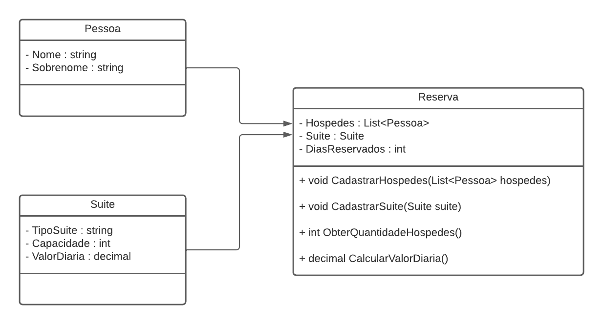

# Desafio de Hospedagem

Projeto desenvolvido como parte do curso **DIO XP Inc. - Full Stack Developer**, na trilha **.NET - Explorando a Linguagem C#**.

## Sobre o projeto

Este desafio consiste na implementação de um sistema simples de hospedagem em console. A aplicação permite cadastrar hóspedes, associá-los a uma suíte e criar uma reserva, calculando a quantidade de hóspedes e o valor total da hospedagem.

O exercício foi proposto para praticar os fundamentos da linguagem C#, incluindo:

- criação e utilização de classes;
- propriedades e construtores;
- relacionamento entre objetos;
- coleções genéricas (`List<T>`);
- validações de regras de negócio;
- exceções;
- operações com valores monetários usando `decimal`.

## Regras de negócio

O sistema segue as seguintes regras:

1. Uma reserva deve estar associada a uma suíte.
2. A quantidade de hóspedes não pode ultrapassar a capacidade da suíte.
3. O método `ObterQuantidadeHospedes()` retorna a quantidade total de hóspedes cadastrados.
4. O valor da hospedagem é calculado multiplicando a quantidade de dias pelo valor da diária.
5. Reservas com **10 dias ou mais** recebem desconto de 10% sobre o valor total.
6. Caso a capacidade da suíte seja insuficiente, uma exceção é lançada e a reserva não é cadastrada.

## Estrutura do projeto

```text
trilha-net-explorando-desafio/
├── Models/
│   ├── Pessoa.cs       # Representa o hóspede
│   ├── Reserva.cs      # Regras e operações da reserva
│   └── Suite.cs        # Dados e capacidade da suíte
├── Program.cs          # Ponto de entrada e demonstração da aplicação
├── DesafioProjetoHospedagem.csproj
└── diagrama_classe_hotel.png
```

### Classes principais

- **`Pessoa`**: armazena nome e sobrenome do hóspede e disponibiliza o nome completo formatado.
- **`Suite`**: representa o tipo da suíte, sua capacidade e o valor da diária.
- **`Reserva`**: relaciona a suíte aos hóspedes, valida a capacidade e calcula o valor da hospedagem.

## Tecnologias utilizadas

- C#
- .NET 6
- Aplicação de console

## Como executar

### Pré-requisitos

- [.NET 6 SDK](https://dotnet.microsoft.com/download/dotnet/6.0) ou versão compatível instalada.

### Passos

No terminal, navegue até a pasta do projeto e execute:

```bash
dotnet restore
dotnet run
```

Também é possível compilar o projeto com:

```bash
dotnet build
```

## Exemplo de funcionamento

O programa de demonstração cria:

- dois hóspedes;
- uma suíte `Premium` com capacidade para duas pessoas e diária de R$ 30,00;
- uma reserva de cinco dias.

Saída esperada:

```text
Hóspedes: 2
Valor diária: R$ 150,00
```

> A formatação do valor pode variar de acordo com a cultura/região configurada no ambiente de execução.

## Diagrama de classes



## Objetivo de aprendizagem

O desafio reforça a aplicação prática de orientação a objetos em C#, mostrando como as classes podem representar entidades do domínio e como suas responsabilidades podem ser combinadas para implementar regras de negócio de forma organizada.

---

**Curso:** DIO XP Inc. - Full Stack Developer  
**Módulo:** .NET - Explorando a Linguagem C#  
**Tipo:** Desafio de projeto
